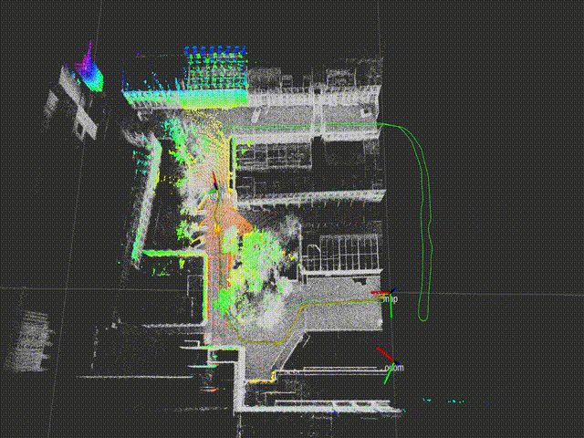
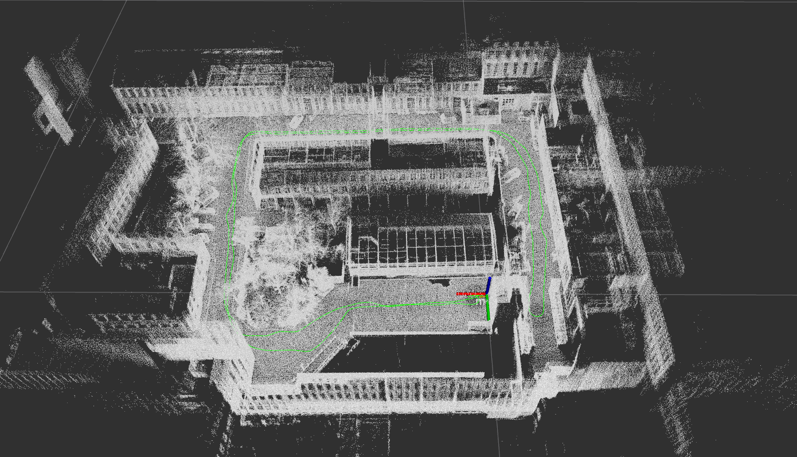
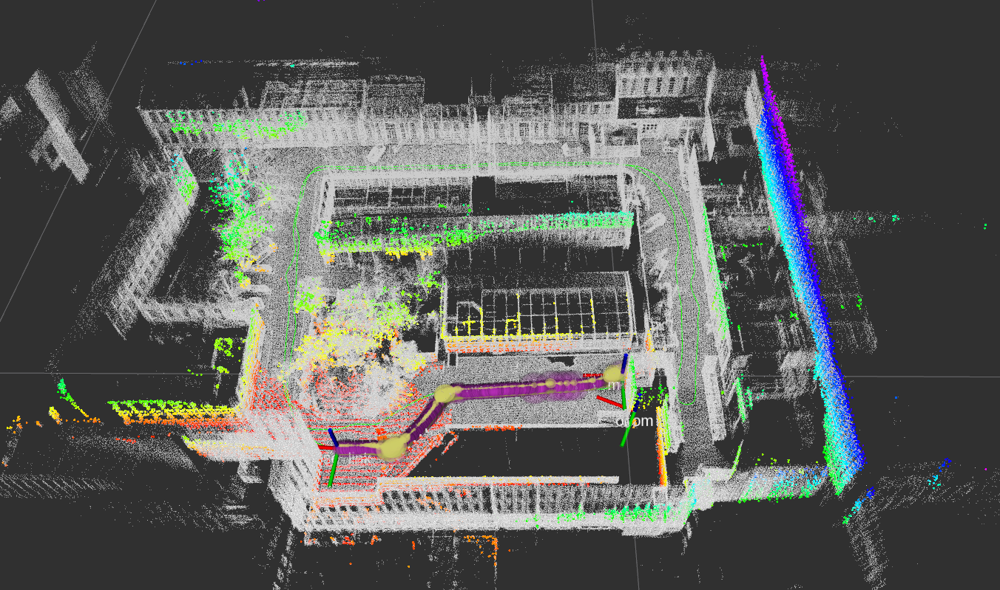

## A ROS-based NDT localizer with multi-sensor state estimation

This repo is a ROS based multi-sensor robot localisation. An NDT localizer is loosely-coupled with wheeled odometry and IMU for continuous global localization within a pre-build point cloud map. 

## Prerequisites
You will need the [robot_localization](http://docs.ros.org/en/melodic/api/robot_localization/html/index.html) package. The configurations of multi-sensors of our robot are detailed in `cfgs/global_ekf.yaml` and `cfgs/local_ekf.yaml`.

## Localization in a pointcloud map(pcd)

A demo video on CourtYard dataset:

[](https://youtu.be/JFto07ufFXM)

## How to use
### Build in your ros workspace
clone this repo in your `ros workspace/src/`, and then `catkin_make` (or `catkin build`):
```bash
cd catkin_ws/src/
git clone https://github.com/FAIRSpace-AdMaLL/ndt_localizer.git
cd ..
catkin_make
```

### Get a pcd map
You need a point cloud map (pcd format) for localization. You can get a HD point cloud map from any HD map supplier, or you can make one yourself (of course, the accuracy will not be as high as the HD map). 

We use our offline version of lio-sam to build the point cloud map:
https://github.com/FAIRSpace-AdMaLL/liosam_mapper

Previously-generated maps can be downloaded from [here](https://drive.google.com/drive/folders/1TtTM9T1s1I-pzLHV4t07wP-gAJw3LyR7?usp=sharing)
The court_yard data (rosbags) for mapping or testing ndt_localizer can be downloaded here: [Court Yard Data](https://drive.google.com/drive/folders/11sSSurwvhftXqFAajDZNHi22Otlc323U?usp=sharing)
The beach data (rosbags and previously-generated maps) can be downloaded here: [Beach Data](https://drive.google.com/drive/folders/1pS4aoEwj1VxV9x5Hg5HrV8soTHA3rUHa?usp=sharing)

### Setup configuration

#### Config map loader
Move your map pcd file (.pcd) to the map folder inside this project (`ndt_localizer/map`), change the pcd_path in `map_loader.launch` to you pcd path, for example:

```xml
<arg name="pcd_path"  default="$(find ndt_localizer)/map/court_yard_map.pcd"/>
```

, then in `ndt_localizer.launch` modify the trajectory path (as a height map for initialization):

```xml
<arg name="path_file" default="$(find ndt_localizer)/map/court_yard_map.csv" doc="Mapping trajectory as height map" />
```

You also need to configure the submap parameters:

```xml
<arg name="submap_size_xy" default="50.0" />
<arg name="submap_size_z" default="20.0" />
<arg name="map_switch_thres" default="25.0" />
```

#### Config point cloud downsample

Config your Lidar point cloud topic in `launch/points_downsample.launch`:

```xml
<arg name="points_topic" default="/os_cloud_node/points" />
```

If your Lidar data is sparse (like VLP-16), you need to config smaller `leaf_size` in `launch/points_downsample.launch` like `1.0`. If your lidar point cloud is dense (VLP-32, Hesai Pander40P, HDL-64 ect.), keep `leaf_size` as `2.0`.

#### Config static tf

There are a static transform from `/world` to `/map`:

```xml
<node pkg="tf2_ros" type="static_transform_publisher" name="world_to_map" args="0 0 0 0 0 0 map world" />
```

#### Config ndt localizer
You can config NDT params in `ndt_localizer.launch`. Tha main params of NDT algorithm is:

```xml
<arg name="trans_epsilon" default="0.05" doc="The maximum difference between two consecutive transformations in order to consider convergence" />
<arg name="step_size" default="0.1" doc="The newton line search maximum step length" />
<arg name="resolution" default="3.0" doc="The ND voxel grid resolution" />
<arg name="max_iterations" default="50" doc="The number of iterations required to calculate alignment" />
<arg name="converged_param_transform_probability" default="3.0" doc="" />
```

These default params work nice with 64 and 32 lidar.

### Run the localizer
Once you get your pcd map and configuration ready, run the localizer with:

```bash
cd catkin_ws
source devel/setup.bash
roslaunch ndt_localizer ndt_localizer.launch
```

Wait a few seconds for the map to load, then you can see your pcd map in rviz.

Give a initial pose of current vehicle with 2D Pose Estimate in the rviz.

This operation will send a init pose to topic `/initialpose`. Then you will see the localization result:



Then, play the rosbag in other terminal (e.g. `rosbag play --clock court_yard_wed_repeat_night_2021-03-03-19-07-18.bag`).

The robot will start localization:



The final localization msg will send to `/odometry/filtered/global` by a multi-sensor state estimation using wheeled odometry, IMU and lidar localisation.

The localizer also publish a tf of `base_link` to `map`:

```
---
transforms: 
  - 
    header: 
      seq: 0
      stamp: 
        secs: 1566536121
        nsecs: 251423898
      frame_id: "map"
    child_frame_id: "base_link"
    transform: 
      translation: 
        x: -94.8022766113
        y: 544.097351074
        z: 42.5747337341
      rotation: 
        x: 0.0243843578881
        y: 0.0533175268768
        z: -0.702325920272
        w: 0.709437048124
```


### Acknowledgement

Thanks for AdamShan's autoware_ros implementation https://github.com/AbangLZU/ndt_localizer.git. 
